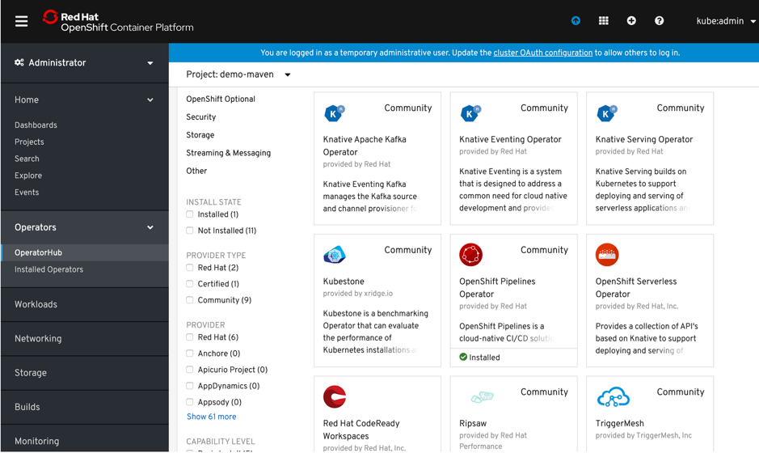
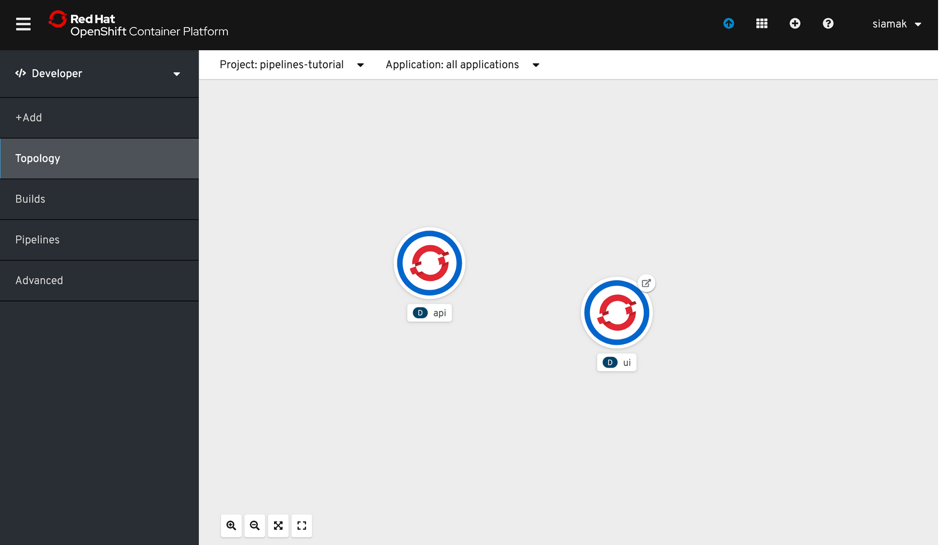

# OpenShift Pipelines Tutorial

Welcome to the OpenShift Pipelines tutorial!

OpenShift Pipelines is a cloud-native, continuous integration and delivery (CI/CD) solution for building pipelines using [Tekton](https://tekton.dev). Tekton is a flexible, Kubernetes-native, open-source CI/CD framework that enables automating deployments across multiple platforms (Kubernetes, serverless, VMs, etc) by abstracting away the underlying details.

OpenShift Pipelines features:
  * Standard CI/CD pipeline definition based on Tekton
  * Build images with Kubernetes tools such as S2I, Buildah, Buildpacks, Kaniko, etc
  * Deploy applications to multiple platforms such as Kubernetes, serverless and VMs
  * Easy to extend and integrate with existing tools
  * Scale pipelines on-demand
  * Portable across any Kubernetes platform
  * Designed for microservices and decentralized teams
  * Integrated with the OpenShift Developer Console

This tutorial walks you through pipeline concepts and how to create and run a simple pipeline for building and deploying a containerized app on OpenShift, and in this tutorial, we will use `Triggers` to handle a real GitHub webhook request to kickoff a PipelineRun.

In this tutorial you will:
* [Learn about Tekton concepts](#concepts)
* [Install OpenShift Pipelines](#install-openshift-pipelines)
* [Deploy a Sample Application](#deploy-sample-application)
* [Install Tasks](#install-tasks)
* [Create a Pipeline](#create-pipeline)
* [Trigger a Pipeline](#trigger-pipeline)

## Prerequisites

You need an OpenShift 4 cluster in order to complete this tutorial. If you don't have an existing cluster, go to http://try.openshift.com and register for free in order to get an OpenShift 4 cluster up and running on AWS within minutes.

You will also use the Tekton CLI (`tkn`) through out this tutorial. Download the Tekton CLI by following [instructions](https://github.com/tektoncd/cli#installing-tkn) available on the CLI GitHub repository.

## Concepts

Tekton defines a number of [Kubernetes custom resources](https://kubernetes.io/docs/concepts/extend-kubernetes/api-extension/custom-resources/) as building blocks in order to standardize pipeline concepts and provide a terminology that is consistent across CI/CD solutions. These custom resources are an extension of the Kubernetes API that let users create and interact with these objects using `kubectl` and other Kubernetes tools.

The custom resources needed to define a pipeline are listed below:
* `Task`: a reusable, loosely coupled number of steps that perform a specific task (e.g. building a container image)
* `Pipeline`: the definition of the pipeline and the `Tasks` that it should perform
* `PipelineResource`: inputs (e.g. git repository) and outputs (e.g. image registry) to and out of a pipeline or task
* `TaskRun`: the execution and result of running an instance of task
* `PipelineRun`: the execution and result of running an instance of pipeline, which includes a number of `TaskRuns`


In short, in order to create a pipeline, one does the following:
* Create custom or install [existing](https://github.com/tektoncd/catalog) reusable `Tasks`
* Create a `Pipeline` and `PipelineResources` to define your application's delivery pipeline
* Create a `PipelineRun` to instantiate and invoke the pipeline

For further details on pipeline concepts, refer to the [Tekton documentation](https://github.com/tektoncd/pipeline/tree/master/docs#learn-more) that provides an excellent guide for understanding various parameters and attributes available for defining pipelines.

The Tekton API enables functionality to be separated from configuration (e.g.
[Pipelines](https://github.com/tektoncd/pipeline/blob/master/docs/pipelines.md)
vs
[PipelineRuns](https://github.com/tektoncd/pipeline/blob/master/docs/pipelineruns.md))
such that steps can be reusable, but it does not provide a mechanism to generate
the resources (notably,
[PipelineRuns](https://github.com/tektoncd/pipeline/blob/master/docs/pipelineruns.md)
and
[PipelineResources](https://github.com/tektoncd/pipeline/blob/master/docs/resources.md#pipelineresources))
that encapsulate these configurations dynamically. Triggers extends the Tekton
architecture with the following CRDs:

- [`TriggerTemplate`](https://github.com/tektoncd/triggers/blob/master/docs/triggertemplates.md) - Templates resources to be
  created (e.g. Create PipelineResources and PipelineRun that uses them)
- [`TriggerBinding`](https://github.com/tektoncd/triggers/blob/master/docs/triggerbindings.md) - Validates events and extracts
  payload fields
- [`EventListener`](https://github.com/tektoncd/triggers/blob/master/docs/eventlisteners.md) - Connects `TriggerBindings` and
  `TriggerTemplates` into an
  [addressable](https://github.com/knative/eventing/blob/master/docs/spec/interfaces.md)
  endpoint (the event sink). It uses the extracted event parameters from each
  `TriggerBinding` (and any supplied static parameters) to create the resources
  specified in the corresponding `TriggerTemplate`. It also optionally allows an
  external service to pre-process the event payload via the `interceptor` field.
- [`ClusterTriggerBinding`](https://github.com/tektoncd/triggers/blob/master/docs/clustertriggerbindings.md) - A cluster-scoped
  TriggerBinding

Using `tektoncd/triggers` in conjunction with `tektoncd/pipeline` enables you to
easily create full-fledged CI/CD systems where the execution is defined
**entirely** through Kubernetes resources.

### Introduction to Tekton Triggers

Before getting started, let’s discuss some of the features of Tekton Triggers. In a nutshell, Tekton Triggers allows users to create resource templates that get instantiated when an event is received. Additionally, fields from event payloads can be injected into these resource templates as runtime information. This enables users to automatically create templated PipelineRun or TaskRun resources when an event is received.

Tekton Triggers introduce three Kubernetes custom resources to configure triggers:

#### TriggerTemplates

A TriggerTemplate declares a blueprint for each Kubernetes resource you want to create when an event is received. Each TriggerTemplate has parameters that can be substituted anywhere within the blueprint you define. In general, you will have one TriggerTemplate for each of your Tekton Pipelines. In this tutorial, you create a TriggerTemplate for your build-and-deploy PipelineRun because you want to create a build-and-deploy PipelineRun every time you receive a pull request event.

#### TriggerBindings

A TriggerBinding describes what information you want to extract from an event to pass to your TriggerTemplate. Each TriggerBinding essentially declares the parameters that get passed to the TriggerTemplate at runtime (when an event is received). In general, you will have one TriggerBinding for each type of event that you receive. In this tutorial, you will create a TriggerBinding for the GitHub pull request event in order to build and deploy the code in the pull request.

#### EventListeners

An EventListener creates a Deployment and Service that listen for events. When the EventListener receives an event, it executes a specified TriggerBinding and TriggerTemplate. In this tutorial, the EventListener will receive pull request events from GitHub and execute the TriggerBinding and TriggerTemplate to create a build-and-deploy PipelineRun.

In the following sections, you will go through each of the above steps to define and invoke a pipeline.

Now that you have a better understanding of Tekton Triggers, let’s dive into the tutorial!

You will be using a useful cloud-native Node.js application called CatApp, which leverages the Cat API to display random pictures of cats. This app is shared on GitHub and can be found here. As you explore the repository, you will find a Dockerfile to build the app and a few Kubernetes configuration files (in the config directory) for a Deployment and Service to run the app. For CI/CD, I’ve created a Tekton Pipeline in the tekton/ directory to build and deploy CatApp.

The following steps illustrate how to integrate CatApp’s build-and-deploy Tekton Pipeline with GitHub so that it runs every time I create a pull request. That way, I can automatically test the code in my pull request.

## Build and run Nodejs app on OpenShift using a cloud native Tekton Pipeline

### Target your cluster

Log in to your IBM Cloud account and navigate to the overview page for your OpenShift cluster. Click on the OpenShift web console button in the upper right corner. On web console, click the menu in the upper right corner (the label contains your email address), and select Copy Login Command. Paste the command into your local console window. It should resemble the following example:

```
oc login https://c100-e.us-east.containers.cloud.
```

### Install OpenShift Pipelines

OpenShift Pipelines is provided as an add-on on top of OpenShift that can be installed via an operator available in the OpenShift OperatorHub. Follow [these instructions](install-operator.md) in order to install OpenShift Pipelines on OpenShift via the OperatorHub.



### Clone the CatApp repository

```bash
git clone https://github.com/IBMDevConnect/catapp.git
```

### Run the CatApp build-and-deploy pipeline

1) Create a project for the sample application that you will be using in this tutorial:

```bash
oc new-project catapp
```

2) OpenShift Pipelines automatically adds and configures a `ServiceAccount` named `pipeline` that has sufficient permissions to build and push an image. This
service account will be used later in the tutorial.

Run the following command to see the `pipeline` service account:

```bash
oc get serviceaccount pipeline
```
3) Apply the CatApp Pipeline and Tasks (in tekton/build-and-deploy-openshift-pipeline.yaml)

```bash
oc apply -f tekton/build-and-deploy-openshift-pipeline.yaml
```
4) Test the CatApp build-and-deploy pipeline with a PipelineRun. Later, you will use the YAML from this PipelineRun to structure your TriggerTemplate.

```bash
tkn pipeline ls
```

**5. Modify the Trigger binding values.**
The TriggerBinding specifies the values to use for your TriggerTemplate’s parameters. The URL and REVISION parameters are especially important because they are extracted from the pull request event body. Looking at the GitHub pull request event documentation, you can find the JSON path for values of the URL and REVISION in the event body. For Tekton Triggers to substitute these JSON paths into values, they must be surrounded by $() and they must start with body (because the values are coming from the event body).

The rest of the parameters in the TriggerBinding have hardcoded values, because they do not come from the pull request event; these values are specific to your OpenShift environment.

So , edit the  values of URL value and REVISION value to your "cloned git URL" and the branch as "master"
```
apiVersion: triggers.tekton.dev/v1alpha1
kind: TriggerBinding
metadata:
  name: catapp-build-and-deploy
spec:
  params:
  - name: URL
    value: $(body.repository.clone_url)
  - name: REVISION
    value: $(body.pull_request.head.sha)
  - name: NAMESPACE
    value: catapp
  - name: DEPLOYMENT
    value: catapp
  - name: SERVICE_ACCOUNT
    value: pipeline
```

6) Apply the CatApp triggers resources:

```bash
oc apply -f tekton/build-and-deploy-openshift-triggers.yaml
```

7) Now verify the pod is running :

```bash
oc get pods 
```

8) Watch the PipelineRun:

```bash
tkn pipelinerun list
tkn pipelinerun logs --last -f
```

### 9. View the deployed Nodejs app

Verify that CatApp has now built and deployed to your OpenShift environment. CatApp is deployed with an OpenShift Route which exposes the app outside of your cluster. You can get the Route URL using:
Get the URL for your route with `oc get route catapp`, and open the route URL in your web browser.

10. Looking back at the project, you should see that the images are successfully built and deployed.



